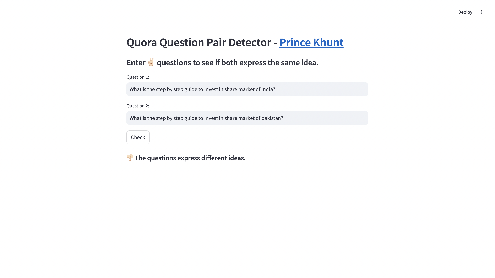

# QuoraQP - Quora Question Pair Prediction <a href="https://quoraquestionpair.streamlit.app/" target="_blank">Live Demo</a>

## UI 





## Description

**QuoraQP** is an ML, DL, and NLP based project designed to predict the similarity of question pairs from the Quora platform. 

## Kaggle

- [QuoraQP LSTM Notebook](https://www.kaggle.com/code/princekhunt19/quoraqp-lstm): This notebook demonstrates the use of Long Short-Term Memory (LSTM) networks for predicting question similarity.
- [QuoraQP XGBoost Notebook](https://www.kaggle.com/code/princekhunt19/quoraqp-xgboost/edit): This notebook explores the XGBoost algorithm to achieve high performance in predicting similar questions.

## Features

- **Question Similarity Prediction:** Predicts whether two questions are similar.

## Installation

1. Clone the repository:
   ```bash
   git clone https://github.com/yourusername/QuoraQP.git
   ```
2. Navigate to the project directory:
   ```bash
   cd QuoraQP
   ```
3. Create a virtual environment (optional but recommended):
   ```bash
   python -m venv venv
   source venv/bin/activate  # On Windows use `venv\Scripts\activate`
   ```
4. Install the required packages:
   ```bash
   pip install -r requirements.txt
   ```

## Run

To run the application, execute the following command:
```bash
streamlit run app.py
```

Follow the prompts in the UI to enter your questions and receive similarity predictions.

## Contribute 

Contributions are welcome! Please follow these steps:

1. Fork the repository.
2. Create a new branch:
   ```bash
   git checkout -b feature/YourFeatureName
   ```
3. Commit your changes:
   ```bash
   git commit -m "Add some feature"
   ```
4. Push to the branch:
   ```bash
   git push origin feature/YourFeatureName
   ```
5. Open a pull request.

## Tech Stack

- DL (RNN-LSTM)
- ML (XGBoost)
- NLP (TfIdf, Word2Vec)
- Streamlit

## Contact

If you have any questions, feel free to reach out:

- LinkedIn: [Prince Khunt](https://www.linkedin.com/in/prince-khunt-linked-in/)