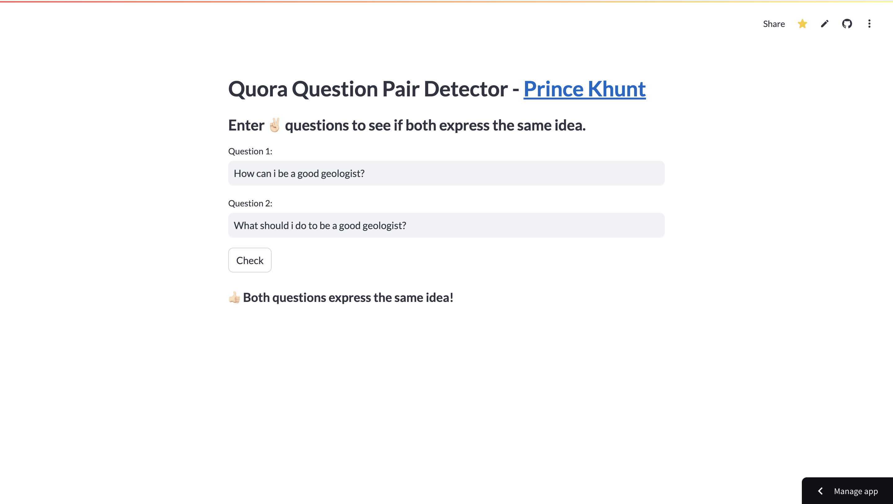

# QuoraQP - Quora Question Pair Prediction <a href="https://quoraquestionpair.streamlit.app/" target="_blank">Live Demo</a>

## Website 

## Description

**QuoraQP** is an ML, DL, and NLP based project designed to predict the similarity of question pairs from the Quora platform. 

## Kaggle

- [QuoraQP LSTM Notebook](https://www.kaggle.com/code/princekhunt19/quoraqp-lstm): This notebook demonstrates the use of Long Short-Term Memory (LSTM) networks for predicting question similarity.
- [QuoraQP XGBoost Notebook](https://www.kaggle.com/code/princekhunt19/quoraqp-xgboost/edit): This notebook explores the XGBoost algorithm to achieve high performance in predicting similar questions.